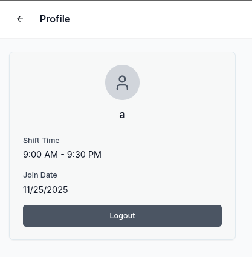
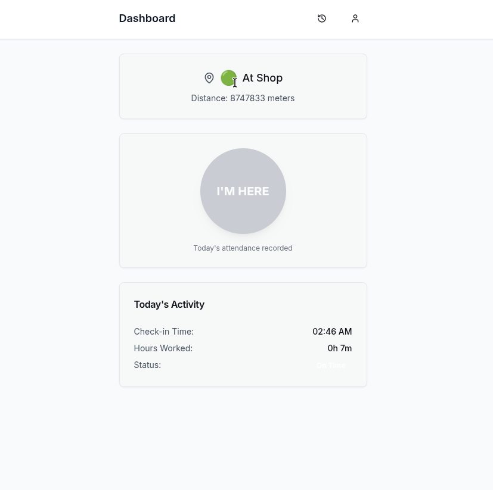
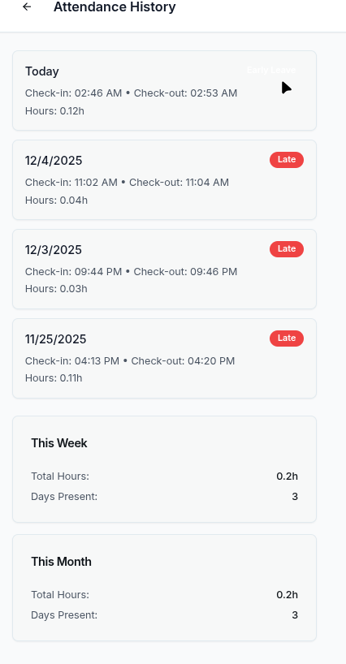
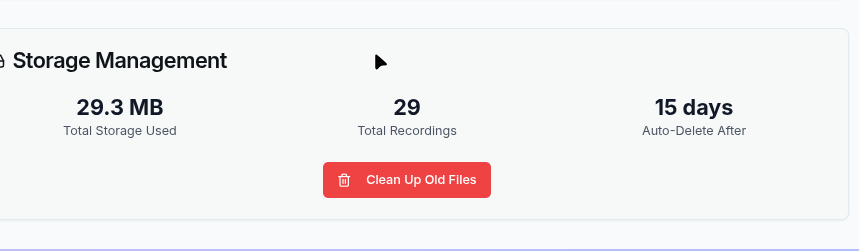

# Shop Audio & Attendance System

A full-stack attendance and audio monitoring solution designed for shop environments. This system enables secure employee check-ins via a mobile web interface while recording background audio for quality assurance.

## Overview


*Secure login portal*


*Mobile-friendly employee check-in interface*


*Real-time staff status and location monitoring*


*Visual audio timeline for reviewing work sessions*

## Core Features

*   **GPS-Gated Attendance:** Restricts check-ins to the physical shop location.
*   **Background Audio Recording:** continuously records audio while the employee is clocked in, utilizing native browser capabilities or Wake Lock to maintain activity.
*   **Admin Dashboard:** Provides real-time employee status, playback history with visual waveforms, and automated work-hour calculations.
*   **Secure Tunneling:** Includes scripts for exposing the local server to the internet via Cloudflare or Tailscale.

## Quick Start (Windows)

This project includes automated PowerShell scripts for setup and execution.

### 1. Installation

Run the installer script to check for Node.js, install dependencies, and configure the database.

```powershell
.\scripts\install-deps.ps1
```

### 2. Running the Application

Run the launcher script to start the server and the secure tunnel.

```powershell
.\scripts\start-app.ps1
```

*   **Admin Access:** Navigate to `http://localhost:5000` on the host PC.
*   **Employee Access:** The script generates a QR code and a public URL (e.g., `https://random-name.trycloudflare.com`). Employees can scan this to access the interface.

## Mobile App Setup

For consistent recording performance, ensure the application remains active on the mobile device.

### Web Method (Standard)
Employees scan the generated QR code. The browser tab must remain open and the screen active to ensure uninterrupted recording. The URL is dynamic and changes upon server restart.

### Tailscale Method (Permanent)
For a persistent connection that does not change daily:
1.  **PC:** Install Tailscale and log in. Assign a machine name (e.g., `bedi`).
2.  **Phone:** Install the Tailscale app and log in with the same credentials.
3.  **Access:** Employees navigate to `http://bedi:5000`.

## Technical Stack

*   **Frontend:** React, TypeScript, TailwindCSS, Shadcn/UI
*   **Backend:** Node.js, Express
*   **Database:** SQLite / PostgreSQL (Drizzle ORM)
*   **Audio:** Opus/WebM recording with ffmpeg processing
*   **Infrastructure:** Cloudflare Tunnels

## Project Structure

*   `client/` - React frontend application
*   `server/` - Node.js API and WebSocket server
*   `scripts/` - Windows automation scripts
*   `tools/` - Database and tunnel utilities
*   `uploads/` - Local storage for audio files (not version controlled)

**Note:** Audio files are stored locally in the `uploads/audio` directory and are not transmitted to third-party cloud services.